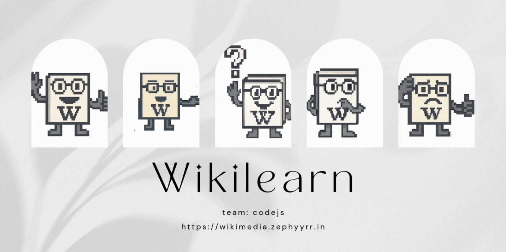
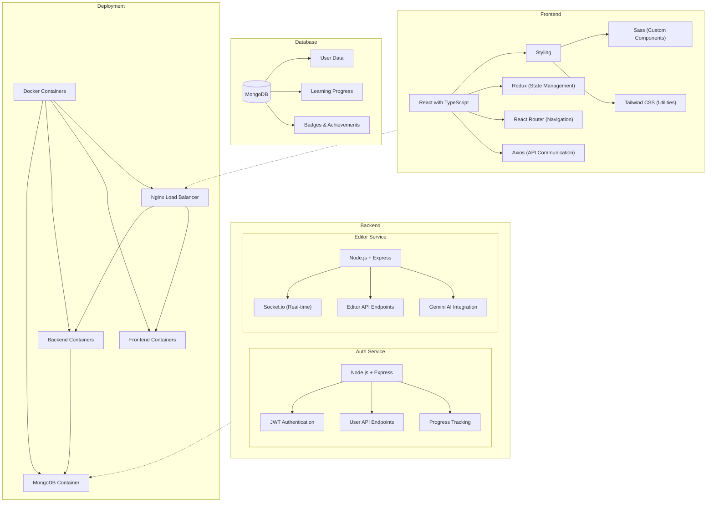

  

   
   

  <a href="#about-"><kbd>   About   </kbd></a>&ensp;&ensp;
  <a href="#key-features-"><kbd>   Key Features   </kbd></a>&ensp;&ensp;
  <a href="#technology-stack-"><kbd>   Technology Stack   </kbd></a>&ensp;&ensp;
  <a href="#usage-"><kbd>   Usage   </kbd></a>&ensp;&ensp;
  <a href="#future-work-"><kbd>   Future Work   </kbd></a>

 

## About 🚀

WikiLearn transforms the way new editors learn Wikipedia's rules and guidelines through an immersive, gamified experience. Developed by Team **CodeJS at HackByte 3.0 (IIIT Jabalpur)**, our platform addresses the steep learning curve that often discourages potential Wikipedia contributors. Inspired by Duolingo's engaging approach to education, WikiLearn converts complex editing principles into digestible, interactive lessons that reward progress and build confidence.

> [!IMPORTANT]
> Our mission is to expand Wikipedia's contributor base by making the onboarding process enjoyable rather than overwhelming. By combining game mechanics with comprehensive educational content, we've created an environment where users can safely practice their skills before entering the actual Wikipedia ecosystem.

## Key Features 🎉

🎮 **Gamified Learning Experience**: The heart of WikiLearn is its gamification system that transforms learning into an achievement-oriented journey. Users earn badges and points as they complete modules, with visual progress indicators providing constant motivation.

📚 **Comprehensive Wikipedia Curriculum**: WikiLearn breaks down Wikipedia's extensive guidelines into structured learning paths that progressively build editing expertise. The curriculum begins with the Five Pillars of Wikipedia, establishing the philosophical foundation of the platform. From there, users explore specific editing guidelines covering topics like proper citation formats, maintaining a neutral point of view, and avoiding original research.

🧠 **Interactive Quizzes**: Knowledge retention is ensured through our robust quiz system that serves as gateways between learning modules. Users cannot progress until demonstrating mastery of the current topic, guaranteeing they build on solid understanding.

🤖 **AI-Powered Assistant**: Recognizing that learners sometimes need guidance, WikiLearn includes an AI assistant designed to support without enabling shortcuts. Unlike traditional chatbots, our assistant never provides direct answers to quiz questions. Instead, it offers contextual hints, suggests relevant learning materials, and asks leading questions that help users discover solutions themselves.

✍️ **Article Editor with AI Feedback (Highlight Feature)**: This revolutionary feature allows users to practice writing Wikipedia articles in a controlled environment before contributing to the actual platform. As users craft content, the AI analyzes their work against Wikipedia's strict standards in real-time, generating a quality score from 0-10. Beyond numerical assessment, the system provides detailed feedback highlighting areas for improvement, identifying guideline violations, and suggesting specific enhancements to align the content with Wikipedia's expectations.

## Technology Stack 💻

##### *
Frontend
*

WikiLearn's frontend combines React with TypeScript for type safety and robust development. We use Sass for custom component styling alongside Tailwind CSS for utility-based rapid development. Redux manages application state, React Router handles navigation between views, and Axios facilitates reliable API communication. This architecture ensures a responsive, maintainable UI that scales with our feature set.

##### *
Backend
*

Our backend features two specialized microservices: an authentication service handling user accounts and progress tracking, and an editor service managing content analysis through Gemini API integration. Both run on Node.js with Express, exposing RESTful endpoints. MongoDB stores user data and learning progress in flexible document structures, while JWT secures sessions and Socket.io enables real-time feedback during editing sessions.

##### *
Deployment
*

WikiLearn employs Docker containerization for consistent environments across development and production. Separate containers for each frontend (course UI, editor UI) and backend service (auth, editor) allow independent scaling. A MongoDB container with persistent volumes ensures data integrity across updates. Nginx provides load balancing and serves as a reverse proxy, creating a unified entry point while directing traffic to appropriate services.

## Usage 📖

WikiLearn is designed to guide users through a complete Wikipedia editing education journey. New users begin by creating an account or signing in to track their progress. They then embark on the gamified learning modules, completing interactive lessons that introduce Wikipedia's principles and practices. After each section, users validate their knowledge through quizzes that ensure comprehension before advancement. Throughout the process, they earn badges and points that recognize their achievements.

The platform's centerpiece is the AI-powered editor where users apply their theoretical knowledge in practical exercises. Here, they can write sample articles that receive real-time analysis and scoring from our Gemini API integration. This feedback loop helps users refine their skills in a consequence-free environment. Upon completing the full curriculum, graduates emerge with the confidence and competence to contribute meaningfully to Wikipedia's knowledge ecosystem.

# Future Work 🔮

While WikiLearn already offers a comprehensive onboarding experience, several exciting enhancements could further elevate the platform:

**Community Integration**: 
Developing direct integration with Wikipedia's actual editing environment would create a seamless transition for graduates. This could include the ability to publish practice articles directly to user sandboxes or even submit them for review by experienced Wikipedia editors. Adding a mentorship program that pairs newcomers with veteran Wikipedians would provide human guidance alongside our AI assistance.

**Advanced Learning Paths**:
Future iterations could include specialized tracks for different types of Wikipedia contributions, such as scientific article writing, multimedia content creation, or translation work. These specialized paths would address the unique challenges of different content domains.

**Multilingual Support**:
Expanding beyond English to support Wikipedia's numerous language editions would significantly broaden our platform's impact. This would require not just translation of interface elements but adaptation of training materials to reflect the specific guidelines of different language communities.

 
 

  

##### *
// Copyright © 2025 codejs
*
